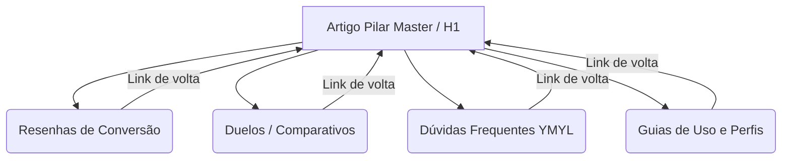

# 📐 Blueprint Reutilizável: Portal de Afiliados Programático de Alta Performance

Este documento serve como a **arquitetura de referência e playbook operacional** para replicar este modelo de blog de afiliados em qualquer outro nicho (ex: cafeteiras, eletrônicos, pet shop, ferramentas). Ele descreve o ecossistema técnico, a estrutura de silos e as regras de SEO/E-E-A-T que garantiram o sucesso deste projeto.

---

## 1. 🏗️ Arquitetura Técnica do Portal

O portal deve ser construído sobre um ecossistema estático e resiliente:

*   **Framework:** Next.js (App Router) para suporte nativo a rotas dinâmicas e layouts flexíveis.
*   **Renderização:** SSG (Static Site Generation) puro. Cada artigo de cauda longa é compilado em HTML estático no build time, garantindo velocidade instantânea (Lighthouse Performance >90%).
*   **Renderizador de Conteúdo:** `next-mdx-remote` para carregar arquivos MDX estruturados com frontmatter e permitir a injeção de componentes React ricos no meio do texto.
*   **Design System:** Tailwind CSS (versão 4+) com o plugin `@tailwindcss/typography` para estilização padrão e fluida de artigos sem necessidade de estilizar tags HTML manualmente.

---

## 2. 🗂️ Estrutura de Silos (Hub & Spoke)

Para dominar a autoridade tópica no Google, o conteúdo deve ser dividido em no máximo 4 Silos Principais:



1.  **O Pilar (Hub):** Um artigo massivo (>2500 palavras) atacando o termo-cabeça (ex: *"Melhor Progressiva Sem Formol"*). Ele deve conter uma introdução forte, tabela comparativa resumida e linkar obrigatoriamente para **todos** os satélites do silo.
2.  **Os Satélites (Spokes):** Artigos curtos e de média cauda (1200 a 1800 palavras) atacando keywords específicas de intenção de compra ou dúvidas técnicas. Todos os satélites devem citar e apontar um link de volta para o Pilar.

---

## 3. 📝 Os 4 Templates de Artigos (Gatilhos de Conversão)

Cada artigo gerado pelo agente de escrita deve obedecer rigidamente a um dos quatro templates, dependendo de sua intenção de busca:

### 🅰️ Template A: Resenhas Comerciais (Money Pages)
*   **Objetivo:** Alavancar conversão de produtos recomendados.
*   **Regra de Ouro:** Apresentar um "Veredito Rápido" (Caixa de Destaque) no primeiro terço da página com o botão de compra (CTA).
*   **CTA:** Link amigável direcionando para o dicionário global de afiliados (`/go/[slug]`).
*   **Estrutura:** Detalhar a tecnologia, pontos positivos, pontos negativos (honestidade), FAQ no final.

### 🅱️ Template B: Comparativos (Duelos - "X vs Y")
*   **Objetivo:** Capturar o usuário na etapa final de decisão de compra (com o cartão na mão na dúvida entre dois produtos).
*   **Estrutura:** Comparação direta dividida em critérios (ex: desempenho, custo, ergonomia), tabela de especificações, veredito apontando o vencedor e CTA duplo para ambos.

### 🅲️ Template C: Perfis de Cabelo / Casos de Uso
*   **Objetivo:** Filtrar o público por características individuais do usuário (ex: *"Cabelo fino"*, *"Loiras"*).
*   **Estrutura:** Foco em resolver a dor específica daquele segmento, sugerindo o melhor produto do silo correspondente para aquela característica.

### 🅳️ Template D: Investigativos / Dúvidas Frequentes (YMYL)
*   **Objetivo:** Construir autoridade científica e responder dúvidas de alto volume de buscas (ex: *"Progressiva faz mal?"*).
*   **Estrutura:** Linguagem técnica e jornalística baseada em estudos e dados regulatórios, respondendo à pergunta diretamente no primeiro parágrafo.
*   **Conversão:** Redirecionar o tráfego ("interim honesto") para as Money Pages seguras (ex: *"Se o produto X é perigoso, a alternativa segura é o produto Y"*).

---

## 4. 🛡️ Contrato de SEO Programático & Validação de Build

O portal deve possuir um mecanismo de validação estrito que **impeça o build de compilar** se as regras de SEO forem violadas no frontmatter dos arquivos MDX.

### O Contrato de Frontmatter Exigido:
```yaml
---
title: "Título SEO otimizado com menos de 60 caracteres"
description: "Meta description para o Google de até 160 caracteres"
date: "2026-07-16"
updated: "2026-07-16"
author: "Nome do Autor (E-E-A-T)"
schemaType: "faq" # ou "review"
faq:
  - q: "Pergunta frequente 1?"
    a: "Resposta direta e objetiva da pergunta 1."
  - q: "Pergunta frequente 2?"
    a: "Resposta direta e objetiva da pergunta 2."
  - q: "Pergunta frequente 3?"
    a: "Resposta direta e objetiva da pergunta 3."
---
```

### Regras de Validação no Build Time:
1.  **Validação de FAQs (AEO):** Cada arquivo MDX **DEVE** conter entre **3 e 7 perguntas no FAQ**. Menos que 3 ou mais que 7 gera erro no build e cancela a compilação.
2.  **Meta Description:** O campo `description` deve ser obrigatório e não pode ultrapassar 160 caracteres.
3.  **Title:** O campo `title` deve ser obrigatório e menor que 65 caracteres.

---

## 5. 💰 Sistema Global de Afiliados (Blindagem e Transparência)

Os links comerciais nunca devem ser inseridos diretamente nos arquivos de texto. Toda a inteligência comercial deve ser centralizada em um dicionário TypeScript (`src/data/afiliados.ts`):

```typescript
export const AMAZON_TAG = 'tag-afiliado-20';

export interface AfiliadoLink {
  asin: string;
  urlBase: string;
}

export const LINKS_AFILIADO: Record<string, AfiliadoLink> = {
  'produto-exemplo': {
    asin: 'B07CN23JR1',
    urlBase: 'https://www.amazon.com.br/dp/B07CN23JR1',
  },
};
```

### Roteamento Amigável:
O portal intercepta rotas do tipo `/go/[slug]`, realiza a busca no dicionário `afiliados.ts`, injeta a tag de associado (`?tag=...`) e parâmetros de analytics/UTM em tempo de execução, e faz o redirecionamento HTTP 302 direto para a loja. Isso simplifica a manutenção dos links quebrados.

---

## 6. 🚦 Passo a Passo para Iniciar um Novo Blog

1.  **Clone Técnico:** Copiar a estrutura do Next.js (pastas `src/`, `public/`, `eslint.config.mjs`, `next.config.ts`, `tsconfig.json`).
2.  **Limpar Conteúdo:** Apagar os arquivos de markdown antigos da pasta `content/` e criar novas pastas correspondentes aos novos 4 silos selecionados.
3.  **Mapear Keywords:** Gerar a planilha mestra de 80 keywords do novo nicho, dividindo-as em 6 lotes lógicos.
4.  **Configurar Afiliados:** Limpar o dicionário `afiliados.ts` e registrar a nova `AMAZON_TAG`.
5. **Produção em Lotes:** Alimentar as pastas MDX respeitando o limite saudável de postagem e garantindo que o build rode com sucesso (`npm run build`).

---

## 7. 🧠 Protocolo de Ingestão de Dados (Deep Dives Obrigatórias)

Para evitar alucinações técnicas e respeitar o **E-E-A-T (Expertise, Authoritativeness, Trustworthiness)** exigido pelo Google, o agente de IA **NUNCA deve iniciar a redação de um novo lote ou silo no escuro**.

### O Agente deve obrigatoriamente solicitar ao usuário:
1.  **Dossiês de Produtos:** Fichas técnicas, ativos químicos reais (ex: sulfito vs ácidos), e links ou resoluções da Anvisa sobre o produto.
2.  **Alertas Clínicos e Reclamações:** Dados sobre o que as consumidoras reclamam (frizz, cheiro, queda de cabelo, quebras) e relatos reais de fóruns ou redes sociais.
3.  **Mapeamento de ASINs (Amazon):** A lista de links confiáveis e vendedores recomendados na Amazon antes de registrar as chaves em `afiliados.ts`.

> [!IMPORTANT]
> Se o usuário pedir para iniciar um novo nicho ou lote sem fornecer esses dados brutos, o agente deve **parar e listar as perguntas críticas (Deep Dives)** necessárias para blindar a qualidade técnica do conteúdo.
